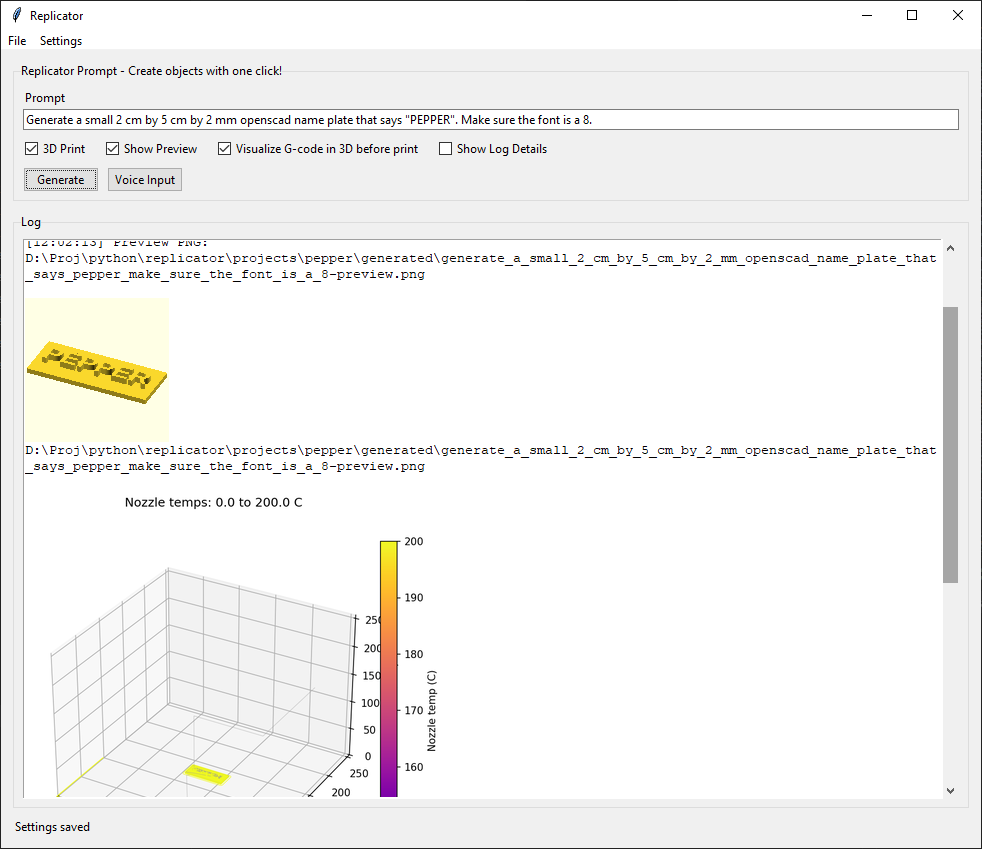

<div align="center">

# Replicator — One‑click prompt‑to‑print

Create 3D objects from natural language or voice, preview in OpenSCAD, visualize toolpaths, and 3D print — all from a friendly desktop app.



</div>

## Highlights

- Prompt or voice to OpenSCAD to OrcaSlicer to printer
- One‑click 3D Print with project‑scoped outputs
- Live log with inline PNG previews (thumbnails and toolpath renders)
- Open the current model directly in OpenSCAD for quick edits
- Optional 3D toolpath visualization before printing
- Safe G-code preflight and optional auto‑fixes (heat order, prime strip)
- Windows‑first experience; settings saved in `replicator.json`

## Quick Start (Windows)

Prereqs: Python 3.11+, OpenSCAD, OrcaSlicer

1) Install Python deps:

```bash
pip install -r requirements.txt
```

2) (Optional) Local pycentauri for printer control:

```bash
pip install -e ..\..\pycentauri
```

3) Launch the app:

```bash
python replicator.py
```

4) In Settings → Paths, set your OpenSCAD and OrcaSlicer locations if they aren’t auto‑detected.

## Using Replicator

1) Enter a prompt (or click Voice Input)
- Examples:
  - “Create a Monopoly‑style top hat token, 20mm wide, 3.5mm thick, no supports.”
  - “Generate a small 100×30×3 mm name plate labeled Pepper.”

2) Choose options
- Show Preview: opens the generated model in OpenSCAD
- Visualize G‑code in 3D before print: renders and saves a PNG, also shown inline in the log
- 3D Print: slices, uploads, and starts the print (with safety checks)
- Show Log Details: toggle verbose command/diagnostic output on/off (image previews always show)

3) File menu
- 3D Print: run the print flow again for the current model
- Open Model in OpenSCAD: jump into OpenSCAD with the active model
- View Log: open `replicator.log` in your system viewer

4) Projects and outputs
- Configure Projects in Settings → Project (root + project name)
- Outputs per project:
  - `projects/<name>/generated/` — `.scad`, preview `.png`, metadata `.json`
  - `projects/<name>/stl/` — exported `.stl`
  - `projects/<name>/gcode/` — sliced `.gcode`

## Configuration Guide (Settings)

- Generation
  - API key/base/model (OpenAI‑compatible), temperature, token limits
  - Whisper model + Voice Seconds
  - Preview size (used for thumbnails)
- Paths
  - OpenSCAD EXE, OrcaSlicer EXE, Orca config + user/system dirs
- Print / Slicing
  - Printer host, auto‑level, timelapse, skip confirmation
  - Filament preset, thumbnail size, prime strip / heat‑order helpers
  - WebSocket port override for simulator (`PYCENTAURI_WS_PORT`)

## Prompt Tips

- Include sizes in mm; keep tokens ~18–24 mm for board games
- Request “no supports”, “flat base”, and “thicker features” where helpful
- For text or symbols, specify raised/debossed height (e.g., 0.8 mm)

## Troubleshooting

- No images in the Log: ensure `Pillow` is installed (it’s in `requirements.txt`). The app logs PNG paths proactively so previews show even with details off.
- “3D Print” appears stuck: the app now streams subprocess output into the Log and to `replicator.log` for visibility.
- Voice Input label/status not updating: recording runs on a background thread; check your default microphone and `Voice Seconds`.
- OpenSCAD or Orca not found: set the Paths in Settings.
- Upload issues: verify printer `host` and that the upload endpoint is reachable.

## Scripts At A Glance

- `replicator.py` — main GUI app (prompt/voice → SCAD → preview/visualize → 3D print)
- `print_scad.py` — SCAD → STL (OpenSCAD) → G‑code (Orca) → upload (+thumbnail + preflight)
- `upload_gcode.py` — upload with local preflight summary and optional confirmation
- `print_file.py` — start a print for an already‑uploaded printer‑side file
- `visualize_gcode.py` — 2D/3D toolpath visualization and PNG export
- `analyze_and_fix_gcode.py` — heat‑order and prime‑strip helpers

---

Replicator — create objects with one click. Have ideas or issues? Open an issue or send a PR!


